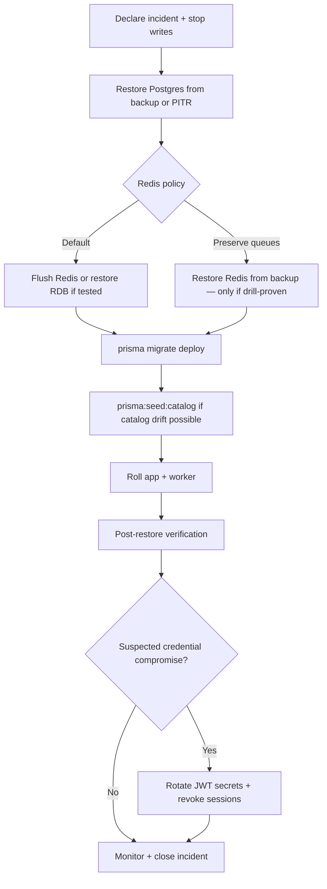

# Disaster Recovery (Backups & DR)

Operational runbook for backing up and restoring this API's data stores. **PostgreSQL is the system of record.** Redis holds operational state (caches, denylist, job queues) that can be rebuilt or flushed with known tradeoffs.

## Targets (defaults)

| Metric  | Target     | Meaning                                                                            |
| ------- | ---------- | ---------------------------------------------------------------------------------- |
| **RPO** | 15 minutes | At most ~15 minutes of committed Postgres data may be lost in a worst-case failure |
| **RTO** | 1 hour     | Service should be restored and verified within ~1 hour of declaring an incident    |

Adjust these for your compliance tier and hosting provider. Document any change here and in your on-call runbook.

## What to back up

### PostgreSQL (required)

Authoritative data: users, roles, permissions, refresh tokens, password-reset and email-verification tokens, RBAC audit log.

| Environment                                                 | Recommended approach                                                                                                                                            |
| ----------------------------------------------------------- | --------------------------------------------------------------------------------------------------------------------------------------------------------------- |
| **Managed Postgres** (RDS, Cloud SQL, Neon, Supabase, etc.) | Enable automated backups + **point-in-time recovery (PITR)**. Set retention ≥ 30 days.                                                                          |
| **Self-hosted / Docker Compose**                            | Scheduled `pg_dump` (see [Local backup scripts](#local-backup-scripts)) stored off-host (S3, GCS, another machine). Run at least daily; hourly for tighter RPO. |

### Redis (conditional)

Local `docker-compose.yml` runs Redis with **AOF** (`--appendonly yes`). Managed Redis should enable persistence (AOF or RDB) if you rely on surviving restarts without data loss.

| Key pattern            | Purpose                   | Lost on Redis failure?                                                                                 |
| ---------------------- | ------------------------- | ------------------------------------------------------------------------------------------------------ |
| `cache:permissions:*`  | Permission cache          | Safe — rebuilt from Postgres on next request                                                           |
| `cache:user-session:*` | Session state cache       | Safe — rebuilt from Postgres                                                                           |
| `auth:failed-logins:*` | Login lockout counters    | Low impact — counters reset; locked users remain `LOCKED` in DB                                        |
| `blacklist:access:*`   | Revoked access JWTs (jti) | **Security impact** — revoked tokens may work until access JWT expires (`JWT_ACCESS_TTL`, default 15m) |
| BullMQ `mail` queue    | Outbound email jobs       | **Operational impact** — in-flight verification/reset emails may need resend                           |

**Policy:** treat Redis as **recoverable but not authoritative**. After Postgres restore, prefer **flushing Redis** and accepting short denylist/cache rebuild unless you have tested Redis backup restore and need to preserve queued mail.

## Local backup scripts

Scripts load `.env` when present and default to Docker Compose Postgres/Redis service names.

```bash
# Postgres custom-format dump → backups/postgres/<db>_<timestamp>.dump
npm run backup:postgres

# Optional: Redis RDB snapshot → backups/redis/redis_<timestamp>.rdb
npm run backup:redis
```

Backups are written under `backups/` (gitignored). Copy artifacts to off-host storage for real DR.

### Restore Postgres (local / Compose)

1. **Stop traffic** — scale `app` and `worker` to zero or stop processes so nothing writes during restore.
2. **Restore database:**

   ```bash
   npm run restore:postgres -- backups/postgres/app_20260625T120000.dump
   ```

3. **Flush Redis** (recommended after DB restore):

   ```bash
   docker compose exec redis redis-cli ${REDIS_PASSWORD:+-a "$REDIS_PASSWORD"} FLUSHDB
   ```

4. **Apply migrations** (idempotent; ensures schema matches code):

   ```bash
   npm run prisma:deploy
   ```

5. **Sync permission catalog** (if code version may differ from backup):

   ```bash
   npm run prisma:seed:catalog
   ```

6. **Start API and worker:**

   ```bash
   docker compose up -d app worker
   # or: npm run start:prod:api && npm run start:prod:worker
   ```

7. **Verify** — see [Post-restore verification](#post-restore-verification).

## Production restore procedure

Use this order for any environment:



### Managed Postgres (PITR)

1. Stop `app` and `worker` (no new writes).
2. In provider console: restore to a **new** instance or clone at target timestamp (≤ RPO).
3. Point `DATABASE_URL` at the restored instance (or swap DNS).
4. Flush Redis (or follow your Redis restore runbook).
5. Run `npm run prisma:deploy` and `npm run prisma:seed:catalog` from a release image or CI job.
6. Roll deployments; run verification.

### Self-hosted `pg_dump` restore

```bash
# From project root, with .env loaded
npm run restore:postgres -- /path/to/backup.dump
```

`pg_restore` uses `--clean --if-exists` against the target database. **This drops and recreates objects in the dump** — only run against the intended database.

## Post-restore verification

Run after every restore (including drills):

| Check       | Command / action                            | Expected                                             |
| ----------- | ------------------------------------------- | ---------------------------------------------------- |
| Liveness    | `GET /health`                               | `200`, `{ "status": "ok" }`                          |
| Readiness   | `GET /health/ready`                         | `200`, database + redis up                           |
| Admin login | `POST /auth/login` with bootstrap admin     | `201`, tokens returned                               |
| Permissions | `GET /auth/me`                              | `roles` / `permissions` present for admin            |
| RBAC read   | `GET /roles` as admin                       | `200`, includes `admin` role                         |
| User list   | `GET /users?page=1&limit=5` as admin        | `200`, paginated data                                |
| Mail worker | Trigger `POST /auth/password-reset/request` | Job enqueued; worker logs send (or Mailpit receives) |

Record results and timestamp in your incident ticket.

## Restore drills

| Phase                 | Cadence                                                                                                 |
| --------------------- | ------------------------------------------------------------------------------------------------------- |
| Pre-production launch | **Monthly** — full restore to staging, run verification checklist                                       |
| Production            | **Quarterly** — restore to isolated environment; never drill on live traffic without maintenance window |

Drill success criteria: RTO met, verification checklist green, runbook gaps documented and fixed.

## Incident: suspected credential compromise

If refresh tokens, JWT secrets, or admin credentials may be exposed:

1. Complete Postgres restore **or** skip restore if DB integrity is intact.
2. **Rotate secrets** (orchestrator / secret manager):
   - `JWT_ACCESS_SECRET` and `JWT_REFRESH_SECRET` (≥ 32 chars) — invalidates all outstanding JWTs.
   - `SEED_ADMIN_PASSWORD` only if admin password compromised:  
     `SEED_ADMIN_ROTATE_PASSWORD=true npm run prisma:seed:admin`
3. **Revoke all refresh tokens** (if not restoring from pre-compromise backup):

   ```sql
   UPDATE "RefreshToken" SET "revokedAt" = NOW() WHERE "revokedAt" IS NULL;
   ```

4. **Flush Redis** (clears denylist and caches; denylist rebuilds as users log out or tokens expire).
5. Force all users to log in again; monitor `rbac.audit` and failed-login metrics.

## Retention

| Artifact                | Minimum retention               | Notes                                           |
| ----------------------- | ------------------------------- | ----------------------------------------------- |
| Postgres backups / PITR | 30 days                         | Extend to 90+ days if audit/compliance requires |
| `RbacAuditLog`          | Match compliance policy         | Lives in Postgres; included in DB backups       |
| Redis RDB/AOF snapshots | 7 days (optional)               | Only if you restore Redis by policy             |
| Off-host backup copies  | Same as source + geo redundancy | Encrypt at rest                                 |

## Related docs

- [README.md](../README.md) — deployment, migrate/seed, pooling
- [RBAC.md](RBAC.md) — audit log queries, production checklist
