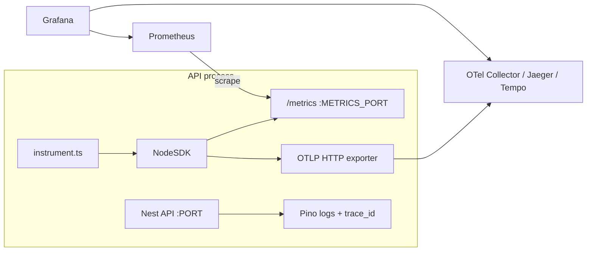

# Observability (OpenTelemetry + Prometheus)

Guide for metrics, distributed tracing, and log correlation in this monorepo. Error tracking via **Sentry** is documented in [README.md](../README.md) and is complementary — not a replacement for OTel.

---

## Overview

| Signal      | Technology                 | Enabled by                                                 | Needs external service?                                                                                                                                |
| ----------- | -------------------------- | ---------------------------------------------------------- | ------------------------------------------------------------------------------------------------------------------------------------------------------ |
| **Metrics** | Prometheus scrape endpoint | `METRICS_ENABLED=true`                                     | **No** for collection — the app starts its own HTTP server on `METRICS_PORT` at `/metrics`. You need Prometheus/Grafana (or `curl`) to **query** them. |
| **Traces**  | OpenTelemetry OTLP HTTP    | `OTEL_TRACES_ENABLED=true` + `OTEL_EXPORTER_OTLP_ENDPOINT` | **Yes** — a collector or backend (Jaeger, Grafana Tempo, OTel Collector, Honeycomb, etc.) must receive spans.                                          |
| **Logs**    | Pino (structured JSON)     | Always on                                                  | Optional — any log aggregator; `trace_id` / `span_id` fields correlate with traces when observability is enabled.                                      |

Metrics and traces are **independent**. Enable either, both, or neither. Both default to **off** so local dev and CI need no extra infrastructure.

Bootstrap runs in `instrument.ts` **before** Nest starts:

- API: [`apps/api/src/instrument.ts`](../apps/api/src/instrument.ts)
- Worker: [`apps/worker/src/instrument.ts`](../apps/worker/src/instrument.ts)



---

## Environment variables

| Variable                      | Default           | Description                                                                       |
| ----------------------------- | ----------------- | --------------------------------------------------------------------------------- |
| `METRICS_ENABLED`             | `false`           | Start Prometheus scrape server                                                    |
| `METRICS_PORT`                | `9464`            | Metrics HTTP port (`/metrics`). Use **9465** for the worker (second process).     |
| `OTEL_TRACES_ENABLED`         | `false`           | Export distributed traces                                                         |
| `OTEL_EXPORTER_OTLP_ENDPOINT` | _(unset)_         | Collector base URL, e.g. `http://localhost:4318` (appends `/v1/traces`)           |
| `OTEL_TRACES_SAMPLER_ARG`     | `0.1`             | Root trace sampling ratio `0`–`1`. Use `1.0` locally; `0.05`–`0.1` in production. |
| `OTEL_SERVICE_NAME`           | `api` or `worker` | Service name in traces and resource attributes                                    |

See [`.env.example`](../.env.example) for copy-paste blocks.

**Docker Compose:** `app` publishes `METRICS_PORT` (default `9464`); `worker` uses `WORKER_METRICS_PORT` (default `9465`). Set observability env vars in `.env` — they are passed through `env_file`.

---

## Local quick start

### Metrics only (no extra containers)

Add to `.env`:

```env
METRICS_ENABLED=true
METRICS_PORT=9464
```

Start the API (`npm run start:dev`), hit a few routes, then:

```bash
curl -s http://localhost:9464/metrics | grep -E '^http_requests_total|^auth_'
```

You should see counters such as:

```text
http_requests_total{method="GET",route="/health",status="200"} 3
auth_login_attempts_total{result="success"} 1
```

For the worker, run a separate terminal with `METRICS_PORT=9465` (or set in `.env` only when running the worker — **each process needs its own port**).

### Traces with Jaeger (local)

Jaeger all-in-one accepts OTLP HTTP on port `4318`:

```bash
docker run -d --name jaeger \
  -p 16686:16686 \
  -p 4318:4318 \
  jaegertracing/all-in-one:latest
```

In `.env`:

```env
OTEL_TRACES_ENABLED=true
OTEL_EXPORTER_OTLP_ENDPOINT=http://localhost:4318
OTEL_TRACES_SAMPLER_ARG=1.0
OTEL_SERVICE_NAME=api
```

Restart the API, make requests, open **http://localhost:16686**, select service `api`, click **Find Traces**.

### Metrics + Prometheus + Grafana (optional local stack)

**Prometheus** — save as `docker/prometheus/prometheus.yml`:

```yaml
global:
  scrape_interval: 15s

scrape_configs:
  - job_name: api
    static_configs:
      - targets: ['host.docker.internal:9464']
  - job_name: worker
    static_configs:
      - targets: ['host.docker.internal:9465']
```

On Linux, replace `host.docker.internal` with your host IP or run Prometheus on the host.

```bash
docker run -d --name prometheus \
  -p 9090:9090 \
  -v "$(pwd)/docker/prometheus/prometheus.yml:/etc/prometheus/prometheus.yml:ro" \
  prom/prometheus:latest
```

**Grafana** — http://localhost:3001 (map host port to avoid clashing with the API):

```bash
docker run -d --name grafana \
  -p 3001:3000 \
  grafana/grafana:latest
```

Add Prometheus (`http://host.docker.internal:9090`) as a data source, then build dashboards from the [example queries](#example-promql) below.

---

## Built-in metrics

Exposed on `http://<host>:<METRICS_PORT>/metrics` when `METRICS_ENABLED=true`.

### HTTP (API — automatic)

Recorded by the global [`HttpMetricsInterceptor`](../apps/api/src/observability/http-metrics.interceptor.ts). No per-route wiring required.

| Metric                          | Type      | Labels                      | Notes                                                          |
| ------------------------------- | --------- | --------------------------- | -------------------------------------------------------------- |
| `http_requests_total`           | Counter   | `method`, `route`, `status` | Route uses Express template when available (e.g. `/users/:id`) |
| `http_request_duration_seconds` | Histogram | `method`, `route`, `status` | Duration in seconds                                            |

Health checks appear as `route="/health"` — exclude from SLO calculations or filter in queries.

### Auth (API — automatic)

Recorded in [`AuthService`](../apps/api/src/auth/auth.service.ts).

| Metric                               | Labels                                                           |
| ------------------------------------ | ---------------------------------------------------------------- |
| `auth_login_attempts_total`          | `result`: `success`, `invalid_credentials`, `locked`, `inactive` |
| `auth_refresh_total`                 | `result`: `success`, `invalid`, `reuse_detected`                 |
| `auth_account_lockouts_total`        | _(none)_                                                         |
| `auth_password_reset_requests_total` | _(none)_                                                         |

### Infrastructure (automatic)

| Metric                         | Source                                                      |
| ------------------------------ | ----------------------------------------------------------- |
| `redis_operation_errors_total` | [`RedisService`](../libs/shared/src/redis/redis.service.ts) |
| `redis_circuit_breaker_state`  | Gauge: `0` closed, `1` open, `2` half-open                  |
| `throttle_rejections_total`    | Incremented on HTTP `429` responses                         |

### Worker (automatic for mail)

Recorded in [`MailProcessor`](../apps/worker/src/processors/mail.processor.ts).

| Metric                      | Labels                         |
| --------------------------- | ------------------------------ |
| `mail_jobs_processed_total` | `result`: `success`, `failure` |
| `mail_job_duration_seconds` | Histogram, `result` label      |

### Auto-instrumentation (traces)

When tracing is enabled, `@opentelemetry/auto-instrumentations-node` captures spans for HTTP/Express, ioredis, and other supported libraries without per-route code. Prisma uses the underlying PostgreSQL driver instrumentation.

---

## Log correlation

When `METRICS_ENABLED` or `OTEL_TRACES_ENABLED` is on, Pino logs include `trace_id` and `span_id` (see [`getOtelLogFields()`](../libs/shared/src/observability/log-context.util.ts) in [`app.module.ts`](../apps/api/src/app.module.ts)).

Example log line (production JSON):

```json
{
  "level": 30,
  "trace_id": "abc123...",
  "span_id": "def456...",
  "req": { "method": "GET", "url": "/users?page=1" },
  "msg": "request completed"
}
```

Use `trace_id` to jump from logs → trace backend. Pass `x-request-id` from clients for cross-service request correlation (already supported via `genReqId`).

---

## Production deployment

1. Set `METRICS_ENABLED=true` and a dedicated `METRICS_PORT` per process (API `9464`, worker `9465`).
2. **Do not expose** `/metrics` on the public internet — scrape from an internal network, sidecar, or service mesh.
3. Set `OTEL_TRACES_ENABLED=true` and `OTEL_EXPORTER_OTLP_ENDPOINT` to your collector (Grafana Alloy, OTel Collector, vendor endpoint).
4. Set `OTEL_TRACES_SAMPLER_ARG` to `0.05`–`0.1` unless you have a specific need for full sampling.
5. Set `OTEL_SERVICE_NAME` per deployable (`api`, `worker`) or rely on defaults from `initOpenTelemetry('api' | 'worker')`.
6. Tag releases with `SENTRY_RELEASE` for errors; optionally set the same value as an OTel resource attribute via your collector.

**Typical scrape config (Prometheus):**

```yaml
scrape_configs:
  - job_name: cursor-3-api
    metrics_path: /metrics
    static_configs:
      - targets: ['api.internal:9464']
  - job_name: cursor-3-worker
    static_configs:
      - targets: ['worker.internal:9465']
```

---

## Example PromQL

Use these as starting points for Grafana panels or alert rules.

**API error rate (5xx):**

```promql
sum(rate(http_requests_total{status=~"5.."}[5m]))
/
sum(rate(http_requests_total[5m]))
```

**p95 latency by route (exclude health):**

```promql
histogram_quantile(
  0.95,
  sum by (le, route) (
    rate(http_request_duration_seconds_bucket{route!="/health"}[5m])
  )
)
```

**Failed login spike:**

```promql
sum(rate(auth_login_attempts_total{result="invalid_credentials"}[5m])) > 10
```

**Refresh token reuse (security):**

```promql
increase(auth_refresh_total{result="reuse_detected"}[1h]) > 0
```

**Redis circuit open:**

```promql
redis_circuit_breaker_state == 1
```

**Mail job failure rate:**

```promql
sum(rate(mail_jobs_processed_total{result="failure"}[5m]))
/
sum(rate(mail_jobs_processed_total[5m]))
```

---

## Extending observability for new domains

See also the [Adding a domain — Observability](ADDING_A_DOMAIN.md#observability) section.

### What you get for free

| You add…                       | Metrics                                                | Traces                              |
| ------------------------------ | ------------------------------------------------------ | ----------------------------------- |
| New Nest controller routes     | `http_requests_total`, `http_request_duration_seconds` | HTTP/Express spans                  |
| Prisma queries in services     | —                                                      | DB spans (via auto-instrumentation) |
| Redis via `RedisService`       | Error + circuit metrics (shared)                       | ioredis spans                       |
| New BullMQ processor in worker | Add job counters (see below)                           | Consumer spans (auto)               |

**No** per-module interceptor registration, **no** changes to `app.module.ts` for basic HTTP coverage.

### Custom business metrics

Add counters/histograms when HTTP labels are not enough (e.g. `orders_paid_total`, `webhook_retries_total`).

1. Add helpers in [`libs/shared/src/observability/metrics.util.ts`](../libs/shared/src/observability/metrics.util.ts) (follow the `recordLoginAttempt` / `recordMailJob` pattern).
2. Export from [`libs/shared/src/observability/index.ts`](../libs/shared/src/observability/index.ts) and [`libs/shared/src/index.ts`](../libs/shared/src/index.ts).
3. Call from your service or processor — helpers no-op when `METRICS_ENABLED` is false.

```typescript
// libs/shared/src/observability/metrics.util.ts
import { Counter, metrics } from '@opentelemetry/api';
import { isMetricsEnabled } from './otel.util';

let ordersCreated: Counter | undefined;

export function recordOrderCreated(result: 'success' | 'failure'): void {
  if (!isMetricsEnabled()) return;
  ordersCreated ??= metrics
    .getMeter('cursor-3-orders')
    .createCounter('orders_created_total', {
      description: 'Orders created by result',
    });
  ordersCreated.add(1, { result });
}
```

**Naming conventions:**

- Suffix counters with `_total` (Prometheus style).
- Use lowercase snake_case.
- Keep label cardinality low — never use user IDs, emails, or unbounded IDs as labels.
- Prefer a `result` or `status` label over many metric names.

### Custom trace spans

Use manual spans for multi-step business operations where auto-instrumentation is too coarse:

```typescript
import { trace } from '@opentelemetry/api';

const tracer = trace.getTracer('cursor-3-orders');

async createOrder(body: CreateOrderBody) {
  return tracer.startActiveSpan('orders.create', async (span) => {
    try {
      const order = await this.prisma.order.create({ /* ... */ });
      span.setAttribute('orders.currency', body.currency);
      return order;
    } catch (error) {
      span.recordException(error as Error);
      throw error;
    } finally {
      span.end();
    }
  });
}
```

Pick a tracer name per domain (`cursor-3-{domain}`). Avoid PII in span attributes.

### New worker process

1. Create `apps/{name}/src/instrument.ts`:

   ```typescript
   import { initOpenTelemetry, initSentry } from '@app/shared';

   initOpenTelemetry('worker');
   initSentry('worker');
   ```

2. Import `./instrument` as the **first** line of `main.ts`.
3. Assign a unique `METRICS_PORT` and `OTEL_SERVICE_NAME` per worker type in env / compose.

Mirror [`MailProcessor`](../apps/worker/src/processors/mail.processor.ts) for job duration and success/failure counters.

---

## Sentry coexistence

| Concern              | Sentry                                  | OpenTelemetry                                                  |
| -------------------- | --------------------------------------- | -------------------------------------------------------------- |
| Unhandled exceptions | `SENTRY_DSN`, filters capture to Sentry | —                                                              |
| Performance traces   | `SENTRY_TRACES_SAMPLE_RATE` (optional)  | `OTEL_TRACES_ENABLED` (recommended for vendor-neutral tracing) |
| Metrics              | —                                       | `METRICS_ENABLED` + Prometheus                                 |

You can run both Sentry and OTel. Prefer OTel for metrics and primary distributed tracing; use Sentry for error grouping and release health.

---

## Troubleshooting

| Symptom                                | Check                                                                                                                    |
| -------------------------------------- | ------------------------------------------------------------------------------------------------------------------------ |
| Empty `/metrics` or connection refused | `METRICS_ENABLED=true`? Correct `METRICS_PORT`? Port not already in use?                                                 |
| No traces in Jaeger                    | `OTEL_TRACES_ENABLED=true`? `OTEL_EXPORTER_OTLP_ENDPOINT` reachable? Sampler not `0`?                                    |
| No `trace_id` in logs                  | At least one of `METRICS_ENABLED` or `OTEL_TRACES_ENABLED` must be true                                                  |
| Worker metrics missing                 | Worker running with its own `METRICS_PORT`? Scraping `9465` not `9464`?                                                  |
| High cardinality warnings              | Route labels should use `:id` templates — see [`normalizeHttpRoute()`](../libs/shared/src/observability/metrics.util.ts) |

---

## Related files

| Area                     | Path                                                                                                                  |
| ------------------------ | --------------------------------------------------------------------------------------------------------------------- |
| OTel bootstrap           | [`libs/shared/src/observability/otel.util.ts`](../libs/shared/src/observability/otel.util.ts)                         |
| Metric helpers           | [`libs/shared/src/observability/metrics.util.ts`](../libs/shared/src/observability/metrics.util.ts)                   |
| Log correlation          | [`libs/shared/src/observability/log-context.util.ts`](../libs/shared/src/observability/log-context.util.ts)           |
| HTTP metrics interceptor | [`apps/api/src/observability/http-metrics.interceptor.ts`](../apps/api/src/observability/http-metrics.interceptor.ts) |
| Env validation           | [`libs/shared/src/config/env.schema.ts`](../libs/shared/src/config/env.schema.ts)                                     |
| Domain module guide      | [ADDING_A_DOMAIN.md](ADDING_A_DOMAIN.md)                                                                              |
